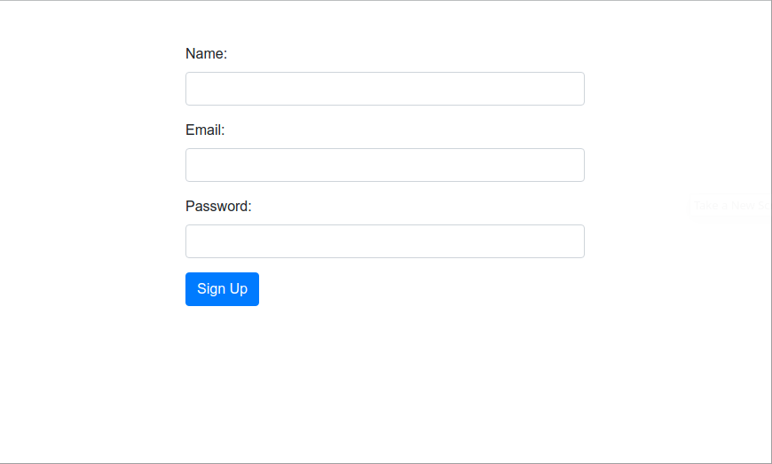
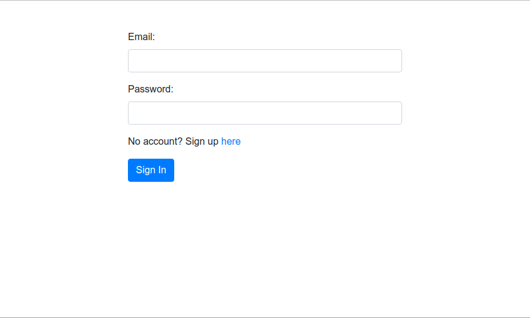
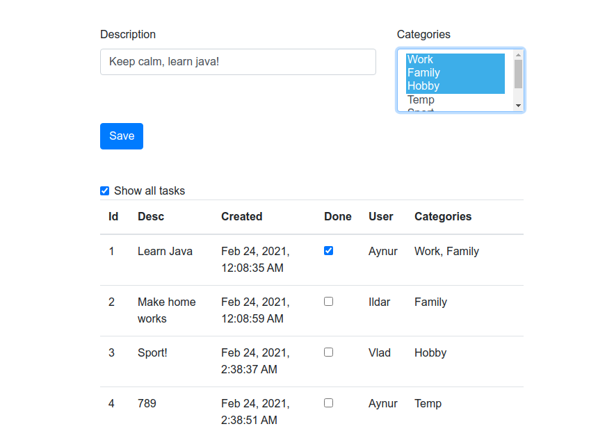

# job4j_todo
## О проекте
Клиент-серверное приложение (Servlet JSP). Список дел (TODO).

## Функциональность
- Регистрация пользователя.
- Авторизация.
- Добавление задач.
    - Описание задачи.
    - Категории задачи.

## Используемые технологии
 - Общая схема клиент-серверного приложения.
 - Протоколы HTTP и HTTPS.
 - Servlet.
 - JSP, MVC.
 - Filter, Session, Auth.
 - Клиентские языки HTML, JS, jQuery, AJAX, CSS, Bootstrap 4.
 
### Изображения

